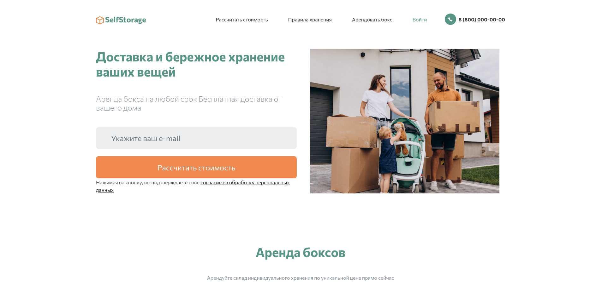
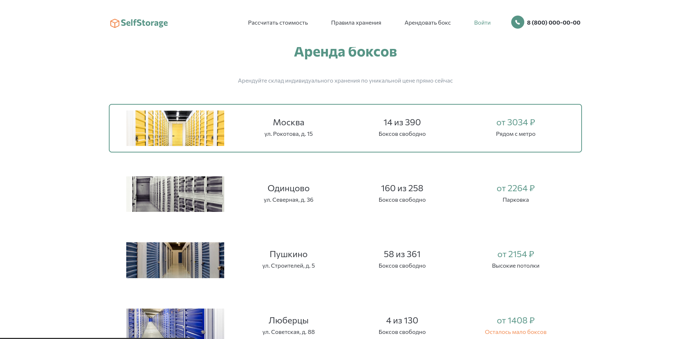

# Проект "SelfStorage"



## Требовании:
Для работы проекта требуется Python 3.9 и старше 

### 1. Скачивания проекта
```shell
git clone https://github.com/ZiganshinIB/SelfStorage.git
cd SelfStorage
```
**Важно!** Возможно, вместо команды `python` здесь и в остальных инструкциях этого README придётся использовать `python3`. Зависит это от операционной системы и от того, установлен ли у вас Python старой второй версии.
### 2. В каталоге проекта создайте виртуальное окружение:
```sh
python -m venv .venv
```
Активируйте его. На разных операционных системах это делается разными командами:

- Windows: `.\.venv\Scripts\activate`
- MacOS/Linux: `source .venv/bin/activate`

### 3. Установка зависимостей
```shell
pip install -r requirements.txt
```
также требуется установить [Redis](https://redis.io/downloads/)
В для ubuntu:
```shell
sudo apt update
sudo apt install redis-server
```
Откройте конфигурационный файл:
```shell
sudo nano /etc/redis/redis.conf
```
Замените значение директивы supervised на systemd. Строка будет иметь следующий вид:
```text
# ...
supervised systemd
# ...
```
Перезапустите службу Redis:
```shell
sudo systemctl restart redis.service
```
### 4. Объявление переменных среды (необходимо для запуска пректа)
В файле settings.py есть настройка `SECRET_KEY` — это секретный ключ, применяемое для защиты от [CSRF атак](https://learn.javascript.ru/csrf).
<br> По этой причине ключ хранится в переменной окружение. 
<br> Для этого необходимо создать файл `.env` в директории с проектом
```shell
nano .env
```
И определите следующие переменые среды в этом файле
```shell
export SECRET_KEY=django-insecure
export DEBUG=false
export ALLOWED_HOSTS=HOST_NAME,HOST_IP,...
```
где 
- `SECRET_KEY` — секретный ключ проекта. Он отвечает за шифрование на сайте. Например, им зашифрованы все пароли на вашем сайте.
- `DEBUG` — дебаг-режим. Поставьте `False`.
- `ALLOWED_HOSTS` — [см. документацию Django](https://docs.djangoproject.com/en/3.1/ref/settings/#allowed-hosts)
- `EMAIL_HOST_USER` - почтовый ящик (*необходимо что бы было gmail)
- `EMAIL_HOST_PASSWORD` - пароль от ПЯ 
Кратко про то как получить данные EMAIL  https://www.codingforentrepreneurs.com/blog/sending-email-in-django-from-gmail/

### 5. Миграция базы данных
```shell
python3 manage.py migrate
```
### 6. Добаление администратора сайта (superusre) для входа в панель администратора
```shell
pyhton3 manage.py createsuperuser
```
### 7. Запуск проектка
```shell
python3 manage.py runserver
```
также требуется запустить celery
```shell
celery -A selfstorage worker --beat --loglevel=ERROR
```

# Допольнительно
## Работа с ПЯ во `views.py`
```Python3
# импорт функции для отправки сообщении 
from django.core.mail import send_mail 

# Обычная отправка сообщении... 
send_mail(
    'Тема сообщения',
    'Сообщение',
    'отправитель@example.com',
    ['получатель1@example.com', 'получатель2@example.com', ... ]
)
#...
```